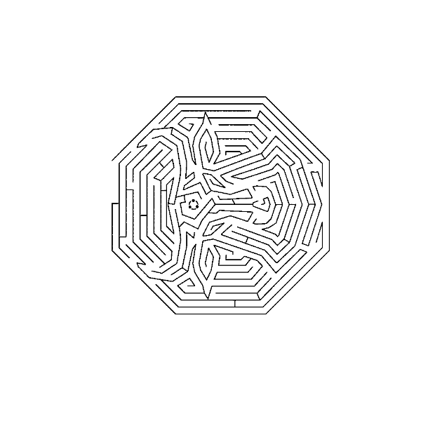
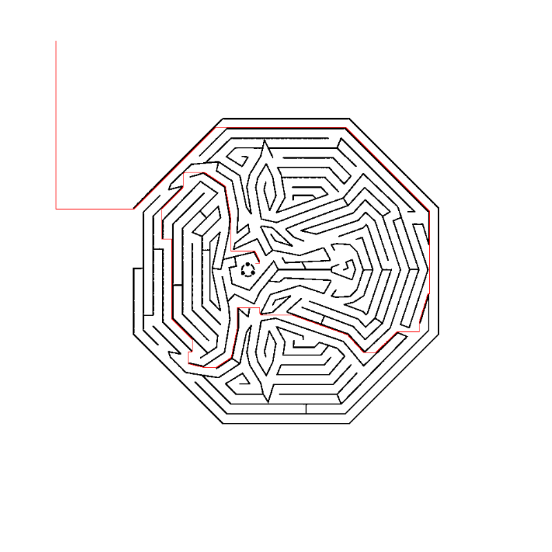

# Maze Solver: Finding a Path to the Ubuntu Logo

A breadth-first search (BFS) pathfinding project in R: extracts a maze pattern from an Ubuntu wallpaper image and solves it programmatically, finding a path from outside the maze to the Ubuntu logo hidden at its center.

Course project — Basic R Programming, SGH Warsaw School of Economics.

## Status

✅ Tested and verified against the actual maze data — path found and confirmed visually (see `images/maze_solution_path.png`).

## What this project does

1. **Image processing** (`magick` package): reads the wallpaper image, crops to the 800×800 region containing the maze, quantizes it to two colors, and converts it into an 800×800 logical matrix (`TRUE` = open space, `FALSE` = wall).
2. **Pathfinding**: implements breadth-first search from a preallocated integer queue (not a growing list — see *Design notes* below) to find a path from an entrance point on the edge of the image to a target region at the maze's center, where the Ubuntu logo sits.
3. **Visualization**: renders the maze with the discovered path overlaid in red.

## Result

A path was found: **2,810 steps**, exploring 580,831 of the 640,000 cells in the grid (BFS floods most of the open background before threading into the maze interior — expected, since ~94% of the image is open space and only ~6% is wall).

| Unsolved maze | Solved path |
|---|---|
|  |  |

## Design notes / what was fixed from the first draft

An earlier version of this script had the open-space/wall condition inverted (treating the 94%-majority background as walls and the thin printed maze lines as open space), which meant the search space was almost entirely blocked and no path could ever be found. Fixing that required first inspecting the actual matrix values against the rendered image, rather than assuming the encoding — a reminder that with any binary image-to-matrix conversion, it's worth explicitly verifying which value means what before writing logic on top of it.

The BFS itself was also rewritten to use a preallocated integer array as the queue instead of an R list with `queue[[length(queue)+1]]` / `queue[-1]` operations — the latter reallocates the entire list on every dequeue, which doesn't scale to an 800×800 (640,000-cell) search space.

## Setup

### Requirements
- R (>= 4.0)
- [`magick`](https://cran.r-project.org/package=magick) package (for image processing)

```r
install.packages("magick")
```

### Repo structure
```
.
├── README.md
├── maze_solver.R
└── images/
    ├── wallpaper.png            # source image
    ├── maze_unsolved.png        # extracted maze, no path
    └── maze_solution_path.png   # extracted maze with solved path (generated by the script)
```

### Running it
```bash
Rscript maze_solver.R
```

This will:
- Read `images/wallpaper.png` and derive the maze matrix (saved as `maze.RDS` in the working directory, not tracked in this repo — regenerate it by running the script)
- Run the BFS solver and print the result to console
- Save the solved-path visualization to `images/maze_solution_path.png`

If you already have `maze.RDS` from a previous run and want to skip re-deriving it from the image, comment out the image-processing block at the top of the script and load it directly with `readRDS("maze.RDS")`.

## Author

Ahmed Abu Deiab — www.linkedin.com/in/ahmed-abu-deiab · Cost of Living Analyst, Mercer · MSc Advanced Analytics – Big Data, Warsaw School of Economics SGH
